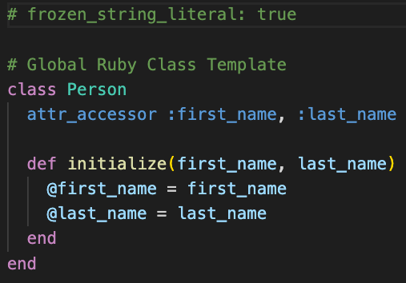

# K Builder

> KBuilder provides various fluent builders and code generators for initializing applications with different language requirements

As a Polyglot Developer, I want to be up and running in any development language with consistency, so I am productive and using best practices

## Usage

### Configure And Build

Print the configuration

```ruby
usecases_folder = File.join(Dir.getwd, 'spec', 'usecases')

KBuilder.configure do |config|
  config.template_folder = File.join(usecases_folder, '.app_template')
  config.global_template_folder = File.join(usecases_folder, '.global_template')
  config.target_folder = File.join(usecases_folder, '.output')
end

puts JSON.pretty_generate(KBuilder.configuration.to_hash)
```

```javascript
{
  "target_folder": "/Users/name/dev/kgems/k_builder/spec/usecases/.output",
  "template_folder": "/Users/name/dev/kgems/k_builder/spec/usecases/.app_template",
  "global_template_folder": "/Users/name/dev/kgems/k_builder/spec/usecases/.global_template"
}
```

#### Folder Structure (starting)

Example folder structure for this usecase before running the builder

> Note: app-templates will take preference over global templates


#### Run builder

This example builder will add 4 files into the output folder.

1. `main.rb` is based on `class.rb` from `app_template`
2. `person.rb` & `address.rb` are based on `model.rb` from `global_template`
3. `configuration.log.txt` is based on an inline template

```ruby
template = <<~TEXT
  Configured Template Folder        : {{a}}
  Configured Global Template Folder : {{b}}
  Configured Output Folder          : {{c}}
TEXT

builder = KBuilder::Builder.init

builder
  .add_file('main.rb', template_file: 'class.rb', name: 'main')
  .add_file('person.rb',
            template_file: 'model.rb',
            name: 'person',
            fields: %i[first_name last_name])
  .add_file('address.rb',
            template_file: 'model.rb',
            name: 'address',
            fields: %i[street1 street2 post_code state])
  .add_file('configuration.log.txt',
            template: template,
            a: builder.template_folder,
            b: builder.global_template_folder,
            c: builder.target_folder)
  .add_file('css/index.css',
            template: '{{#each colors}} .{{.}} { color: {{.}} }  {{/each}}',
            colors: ['red', 'blue', 'green'],
            pretty: true)

```

#### Folder Structure (after)

Folder structure after running the builder


#### main.rb


#### person.rb



#### address.rb


#### configuration.log.txt


#### css/index.css


